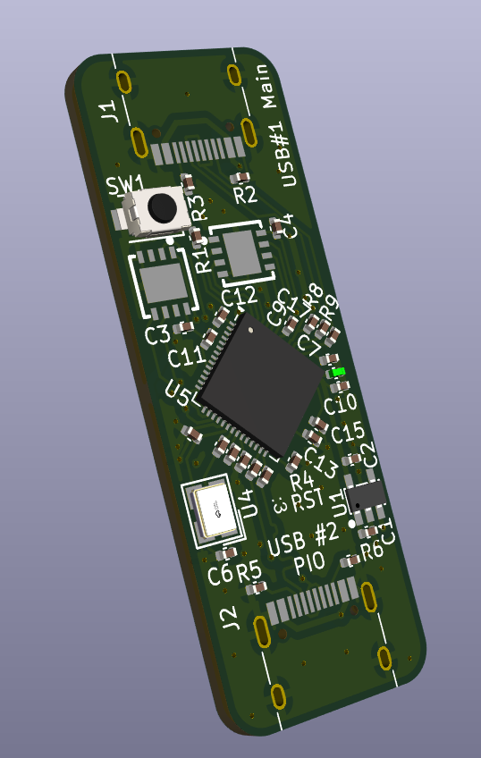
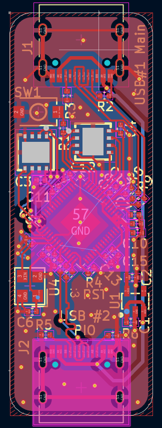
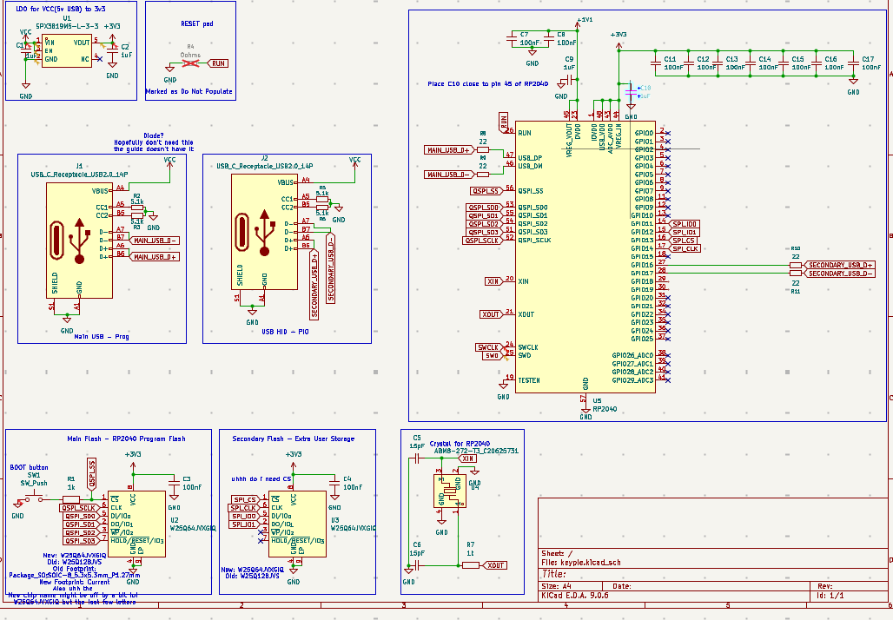

# keypie
A custom RP2040 board with two USBC ports and two flash chips.
add magic sauce here

Can be used as a badUSB or to investigate USB connections(limited)

Firmware:
[https://circuitpython.org/board/raspberry_pi_pico/](https://circuitpython.org/board/raspberry_pi_pico/)

[https://github.com/earlephilhower/arduino-pico](https://github.com/earlephilhower/arduino-pico)

The second USBC port is made to work with RP2040's PIO using adafruit's tinyUSB libraries

